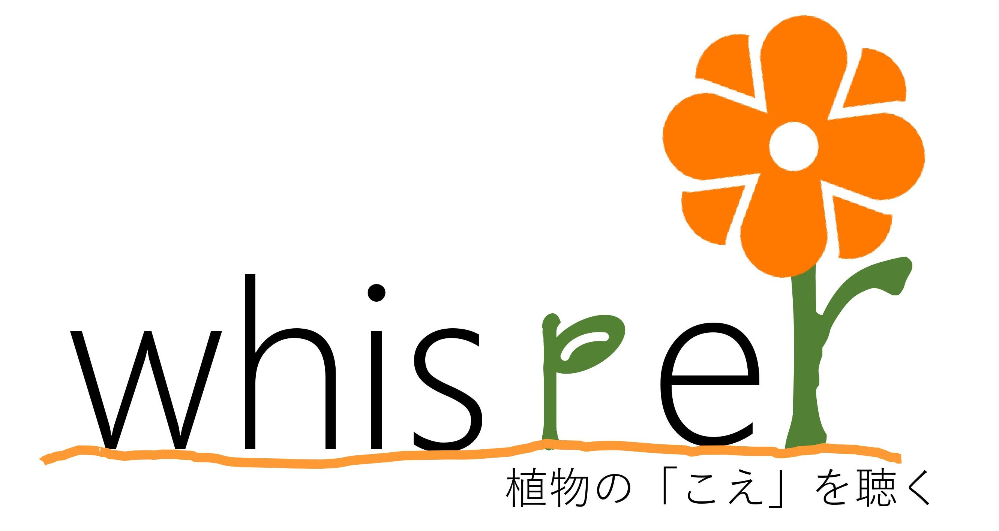
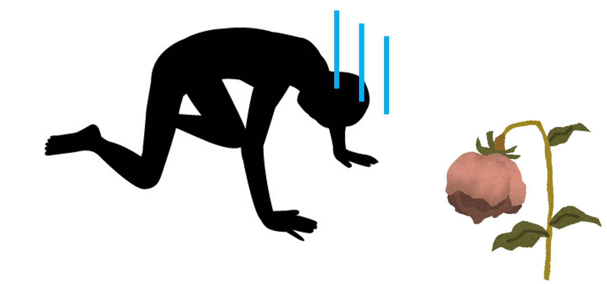
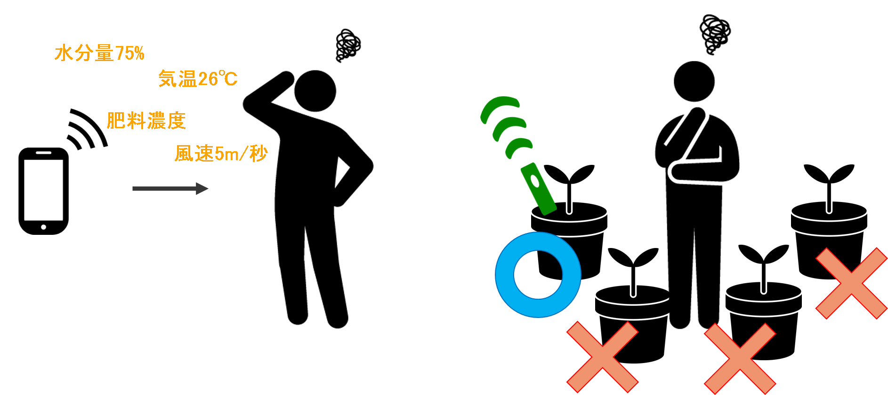
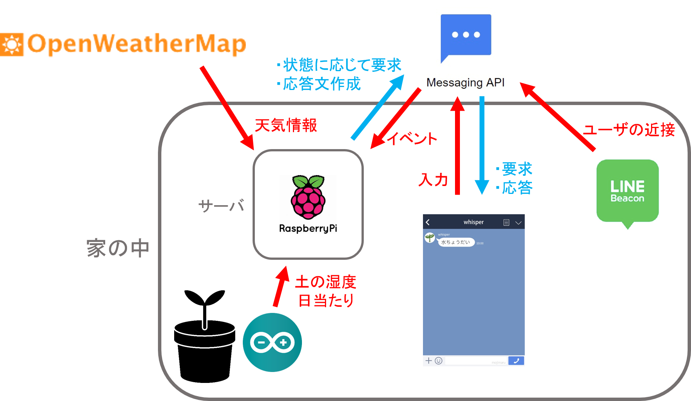

# whisper - 植物の「こえ」を聴く -

## 製品概要
### 園芸 × Tech

### 背景（製品開発のきっかけ、課題等）
#### 今回のプロダクトの開発に至った背景とターゲット

今回のハッカソンのために、メンバーで最近欲しいものについて話していた際、生活に彩を加えるため、部屋に観葉植物が欲しいという声が出てきました。実際、そのようなことを思ったことがある人は多いのではないでしょうか。

しかしそういった人や友人に聞いてみると、「家の植物に水やりを忘れて、うっかり枯らしてしまった」といった話をされました。実際に、メンバー内にも「植物を買ったはいいものの、水やりを忘れたまま３年が過ぎていた（！？）」といった人や、「祖母がたくさんの植物を育てており、水やりなどの管理に苦労している」といった人が居ました。

こういった、家で植物を育てたい人たちのお悩みを解決するため、私たちは「植物がみずから、人に向けてお世話してもらえるよう囁きかける（wisper）」プロダクトを開発しました。

課題の解決とともに、植物とコミュニケーションするという今までにはない体験を楽しんでいただければ嬉しいです。

#### 従来の課題・現状

「植物の状態をモニタリングし、管理する」アプリやサービスは既にいくつも存在していますが、それらは以下のような問題を抱えていました。

 - ユーザに提供する情報量が多すぎ、具体的にすべきことが不明瞭になりがち
 - 複数の植物を育てることを想定していない

そこで私たちは、以下のようなアプローチを取りました

 - 「ユーザに与える情報量を抑える」ことで、すべきことを明確に伝える
 - 「使うセンサー類を、植物の世話に必要な最低限なものに留める」ことで、育てる植物が多くなった場合でも、低コストで対象を増やすことができるようにする

さらに、これらの情報を「植物の声」としてユーザに届けることで、「管理する」といった側面を意識させず、いつまでも親しみを持って植物のお世話が出来るような工夫を加えました。

### 製品説明（具体的な製品の説明）

今回のプロダクトの「植物のお世話に必要な最低限の情報を「声」としてユーザに届ける」といったアプローチから、名前は「whisper」としました

### 特長

#### 1. 植物の「こえ」を聴く
センサーで計測した情報を、グラフなどで直接提示するのではなく、LINEbotを使って「水ちょうだい」「天気がいいから外に出して―」などの、植物からのささやき・声としてユーザに届ける

ユーザが「調子どう？」や「水いる？」と尋ねることで、「いいかんじー」や「いらないよ」といった風に、植物の状態を知ることができる

#### 2. 情報の質
「土の水分量」「日当たりのよさ」「その日の天気」といった、必要最低限の情報のみを計測する

#### 3. 複数の植物
センサーとHubで機構を分割することで「ひとつのハブ 対 複数のセンサ」 という形のシステムを実現し、複数の植物にも低コストで対応できる

### 解決出来ること
 - ユーザに必要なお世話の内容をはっきり伝えることで、水のやり忘れややりすぎ、日の光に当て忘れる等のうっかりミスを防止し、植物を元気に保つ
 - これを複数の植物に、比較的手軽に適応させることができる
 - 植物により親しみを持てるようになる

### 今後の展望
 - センサの量産
 - センサとHub間での無線通信
 - 植物ごとの適切な水分量などを保持するデータベースの作成
 - 植物を外に出すかどうかを判断するアルゴリズムの精度の向上
 - ユーザの位置に応じた処理（LINE Beaconを用いて、ユーザが近くにいるときはセンサの計測を頻繁に行い、ユーザが遠くにいる時は計測の頻度を減らすことで、不必要にセンサが劣化（電流と水による酸化）することを防ぐ）

## 開発内容・開発技術

### 活用した技術

#### 使用言語
* Python3.6
* Arduino

#### API・データ

* LINE Messaing API
* LINE Beacon

#### フレームワーク・ライブラリ・モジュール
* ngrok
* Flask
* Minette for Python

#### デバイス
* スマートフォン
* Raspberry Pi 3
* Arduino nano
* 湿度センサ
* 光度センサ
* LINE Beacon

### 独自開発技術（Hack Dayで開発したもの）
#### 2日間に開発した独自の機能・技術

ソフトウェア

* ユーザや植物のデータをjson形式でサーバ側に保管し、利用する技術
* 湿度、照度センサとその入力を受け取るarduinoのスケッチの開発およびその結線
* arduinoで受け取ったセンサ情報をraspiberry piのpythonスクリプトでシリアル通信
* 上記のpythonスクリプトとLine botの走る本体の間で、プロセス間のソケット通信
* 朝6時に天気予報APIを用いて、外に出してほしいか伝える
* バッファにあるセンサ情報を元に、水やりを要求する
* Line Beaconによりユーザが近くにいるかを判別し、センサ情報の取得間隔を変更
* ユーザが植物に状況を聞いたときに、用例応答する

ハードウェア

* 湿度センサ、照度センサ、Arduino nanoを用いた、植物の状態を監視しサーバに送信するセンサーデバイスを作成