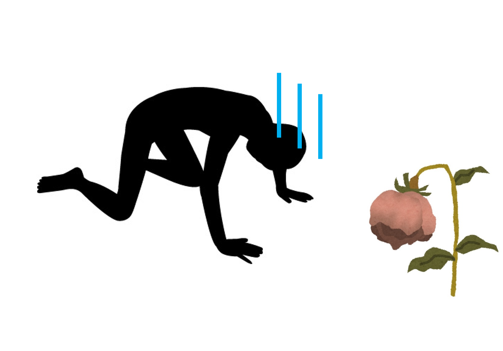

# whisper - 植物の「こえ」を聴く -

## 製品概要
### 園芸 × Tech

### 背景（製品開発のきっかけ、課題等）
- 今回のプロダクトの開発に至った背景

今回のハッカソンのために、メンバーで最近欲しいものについて話していた際、生活に彩を加えるため、部屋に観葉植物が欲しいという声が出てきました。実際、そのようなことを思ったことがある人は多いのではないでしょうか。

しかしそういった人や友人に聞いてみると、「家の植物に水やりを忘れて、うっかり枯らしてしまった」といった話をされました。実際に、メンバー内にも「植物を買ったはいいものの、水やりを忘れたまま３年が過ぎていた（！？）」といった人や、「祖母がたくさんの植物を育てており、水やりなどの管理に苦労している」といった人が居ました。

こういった、家で植物を育てたい人たちのお悩みを解決するため、私たちは「植物がみずから、人に向けてお世話してもらえるよう囁きかける（wisper）」プロダクトを開発しました。

課題の解決とともに、植物とコミュニケーションするという今までにはない体験を楽しんでいただければ嬉しいです。

- 着目した顧客・顧客の課題・現状

### 製品説明（具体的な製品の説明）
こちらに製品の概要・特徴について説明を記載してください。

### 特長

#### 1. 特長1

#### 2. 特長2

#### 3. 特長3

### 解決出来ること
この製品を利用することによって最終的に解決できることについて記載をしてください。

### 今後の展望
今回は実現できなかったが、今後改善すること、どのように展開していくことが可能かについて記載をしてください。

## 開発内容・開発技術
### 活用した技術
#### API・データ
今回スポンサーから提供されたAPI、製品などの外部技術があれば記述をして下さい。

* 
* 
* 

#### フレームワーク・ライブラリ・モジュール
* 
* 

#### デバイス
* 
* 

### 研究内容・事前開発プロダクト（任意）
ご自身やチームの研究内容や、事前に持ち込みをしたプロダクトがある場合は、こちらに実績なども含め記載をして下さい。

* 
* 

### 独自開発技術（Hack Dayで開発したもの）
#### 2日間に開発した独自の機能・技術
* 独自で開発したものの内容をこちらに記載してください
* 特に力を入れた部分をファイルリンク、またはcommit_idを記載してください（任意）
